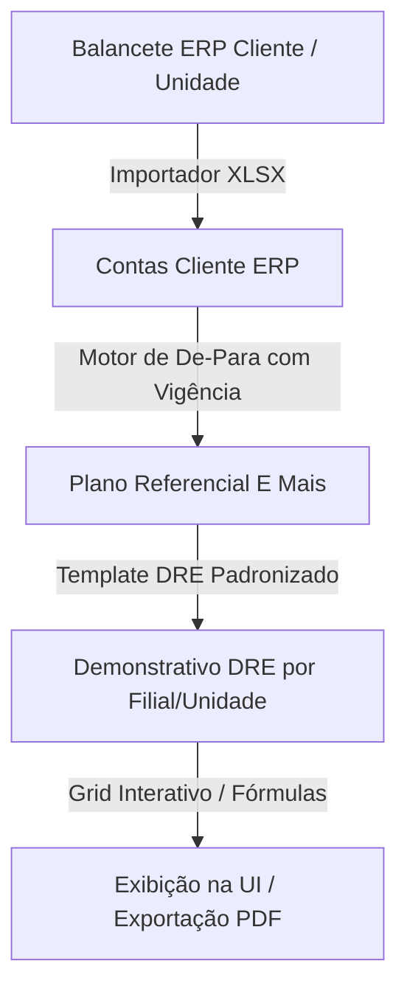

# Projeto de Arquitetura — DRE Multi-Unidades, Motor De-Para e Grid Interativo

Este documento serve como blueprint técnico e plano de implementação passo a passo para a nova fase do sistema **E Mais Consultoria**, integrando a visão de múltiplas unidades de negócio (filiais), importação automatizada (02 modelos XLSX), motor complexo de De-Para e edição direta em grade.

---

## 1. Visão Geral da Arquitetura do Motor

O objetivo central é ter um **Plano Referencial E Mais** único e padronizado. Cada nova empresa/cliente cadastrada no sistema importa seu balancete bruto (ERP) e realiza o mapeamento (De-Para) para o Plano Referencial. O Template da DRE consome as contas referenciais, permitindo comparar múltiplas empresas de forma ágil.



---

## 2. Passo a Passo do Desenvolvimento (Entregas por Partes)

Faremos a implementação dividida em **4 fases lógicas** para garantir testes e validação contínua.

### Fase 1: Modelagem de Dados de Unidades e Lançamentos
Estenderemos as tabelas do banco de dados para suportar a quebra por unidade contábil/filial.

* **Alterações no Schema (`backend/models.py`):**
  - **`Unidade` (Nova Tabela):** Cadastro explícito das filiais vinculadas ao cliente (ex: `id`, `cliente_id`, `nome`). Substituirá o uso exclusivo de listas no JSON de bandeiras para dar integridade referencial.
  - **`LancamentoRef` (Modificação):** Inclusão do campo `unidade_id` (ForeignKey para `Unidade`) ou `unidade_nome`. A constraint de unicidade passará a ser composta: `UniqueConstraint("conta_cliente_id", "ano", "mes", "unidade_nome")`.
  - **`DeParaRef` (Modificação):** Permitir mapeamentos de De-Para específicos por unidade (opcional) ou mantê-los globais por cliente com rateio percentual.

---

### Fase 2: Importação de 02 Modelos XLSX
Desenvolvimento de dois parsers inteligentes e flexíveis no `xlsx_parser.py`:

* **Modelo A (Planilha de DRE Gerencial por Filiais):**
  - **Caso de Uso:** Importa planilhas estruturadas com colunas de filiais (como a analisada `Controladoria E+ Leal 1_Jan2026.xlsx`).
  - **Mecânica:** O parser identifica as filiais listadas nas colunas (Roosevelt, Tibery, Mansour) e lê as linhas contendo as receitas e despesas por conta, gravando os valores individualizados por filial no banco.
* **Modelo B (Balancete Contábil Bruto do ERP):**
  - **Caso de Uso:** Importa arquivos de exportação direta do software contábil do cliente.
  - **Mecânica:** Linhas contendo código de conta contábil, descrição da conta, unidade (filial/centro de custo) e o valor realizado. Mapeia automaticamente códigos novos para a fila de De-Para pendente.

---

### Fase 3: Evolução do Motor De-Para e Fórmulas
Ampliar o motor de cálculo da DRE (`ref_demonstrativos.py`) para processar e consolidar as unidades:

* **Agregação Multi-Unidades:**
  - O backend agrupará os lançamentos por `(agrupamento_referencial, unidade_nome)`.
  - O motor de fórmulas (`ref_formula_engine.py`) rodará o grafo de dependências das linhas de forma independente para cada unidade (resolvendo EBITDA, margens e taxas por filial).
* **Visão de Grade Comparativa:**
  - O endpoint de demonstrativos retornará os valores abertos por unidade no formato:
    ```json
    {
      "rotulo": "RECEITA BRUTA",
      "valores_unidades": {
        "Roosevelt": 3543173.51,
        "Tibery": 1892153.03,
        "Consolidado": 5435326.54
      }
    }
    ```

---

### Fase 4: Frontend - Visão Multiloja e Grid Interativo
Adequar a interface para renderizar a planilha dinâmica:

* **Tabela Dinâmica:**
  - Adição de seletor de Filial (permitindo visualizar uma única filial em 12 meses, ou comparar todas as filiais no mesmo mês em colunas).
  - Componente de grade baseado no estilo visual atual (zebra, realce de negritos, mesmos tons de roxo/azul).
* **Edição de Células In-line:**
  - O clique duplo em células editáveis de contas analíticas abrirá um campo de input direto.
  - Ao salvar (blur ou enter), envia uma chamada de atualização `PUT` ao backend, que recalcula a DRE inteira e atualiza os totais e fórmulas na tela em tempo real.

---

## 3. Opinião Técnica e Recomendações

1. **Vigência Temporal do De-Para:** A ideia de versionamento temporal em `DeParaRef` (campo `vigente_a_partir`) já existente no banco é excelente. Devemos mantê-la ativa para garantir que, caso o cliente mude o mapeamento do ERP em março, os meses de janeiro e fevereiro permaneçam inalterados.
2. **Rateio Administrativo Centralizado:** Como o administrativo (ADM) possui contas específicas (ADM331102), é comum ratear o escritório central entre as lojas. O sistema deve permitir configurar um percentual fixo de rateio por loja para automatizar o lançamento das despesas indiretas.
3. **Persistência de Fórmulas:** Manteremos o motor de fórmulas (`ref_formula_engine.py`) livre de lógica de banco. Ele deve apenas receber os valores agregados e processar. A complexidade de unidades fica restrita à camada de consulta do ORM.
